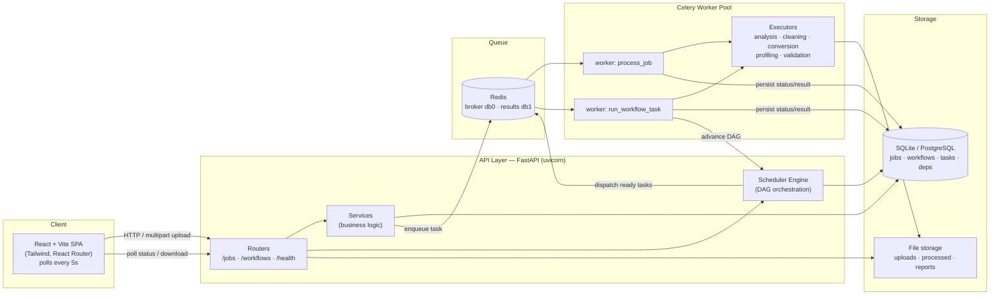
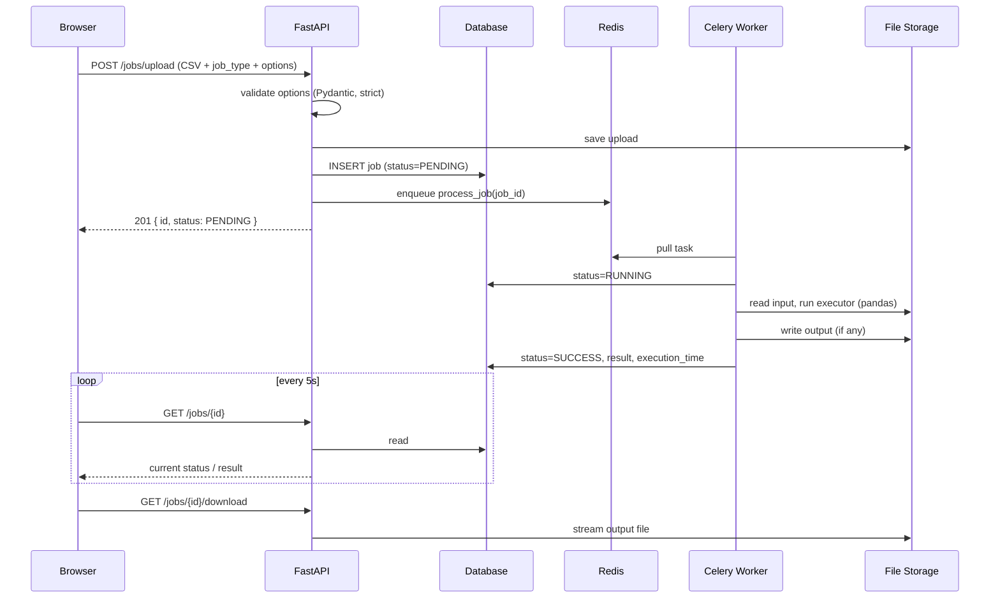
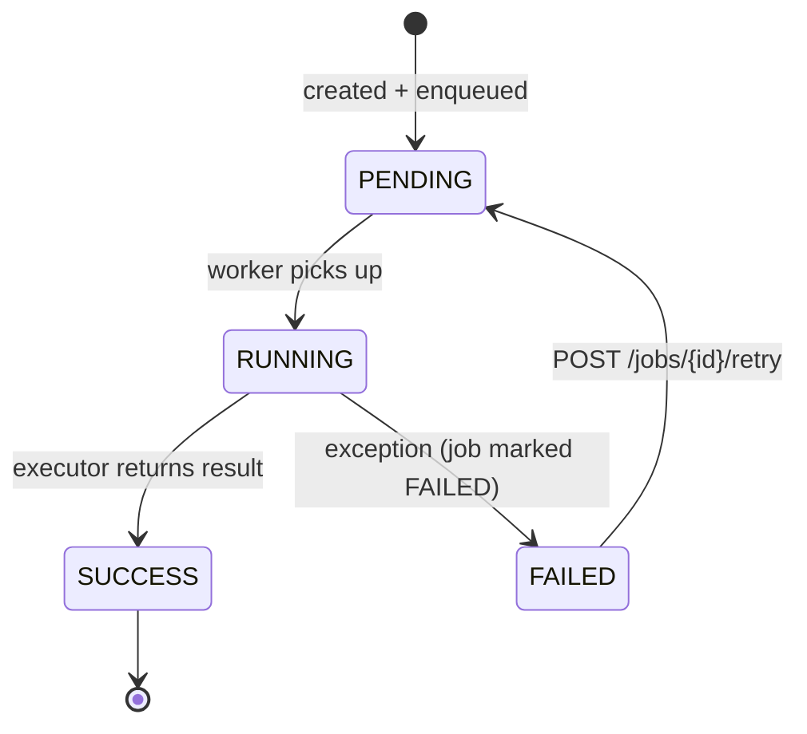
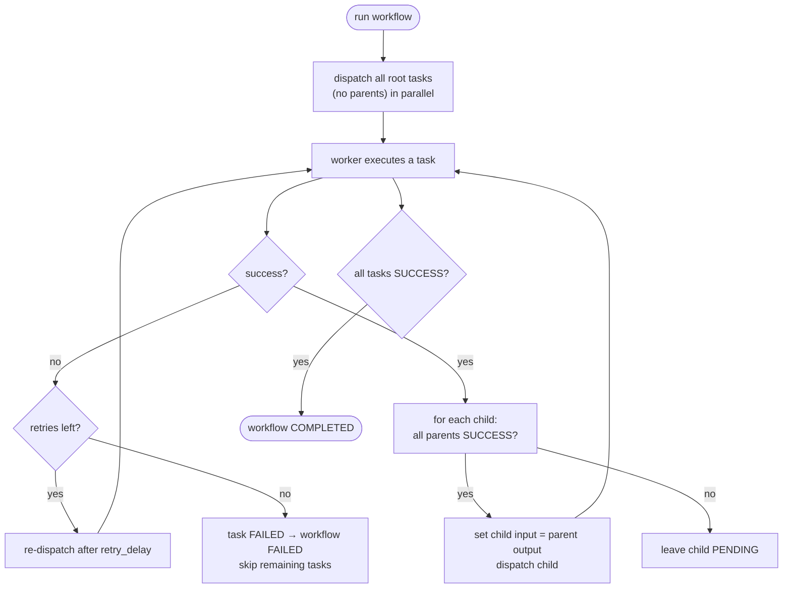
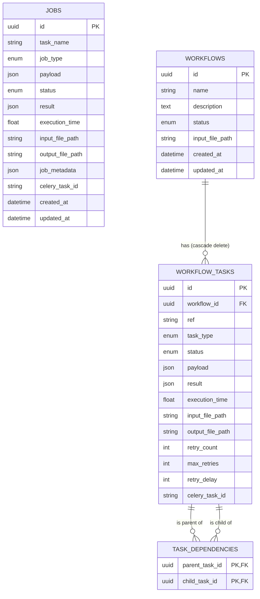
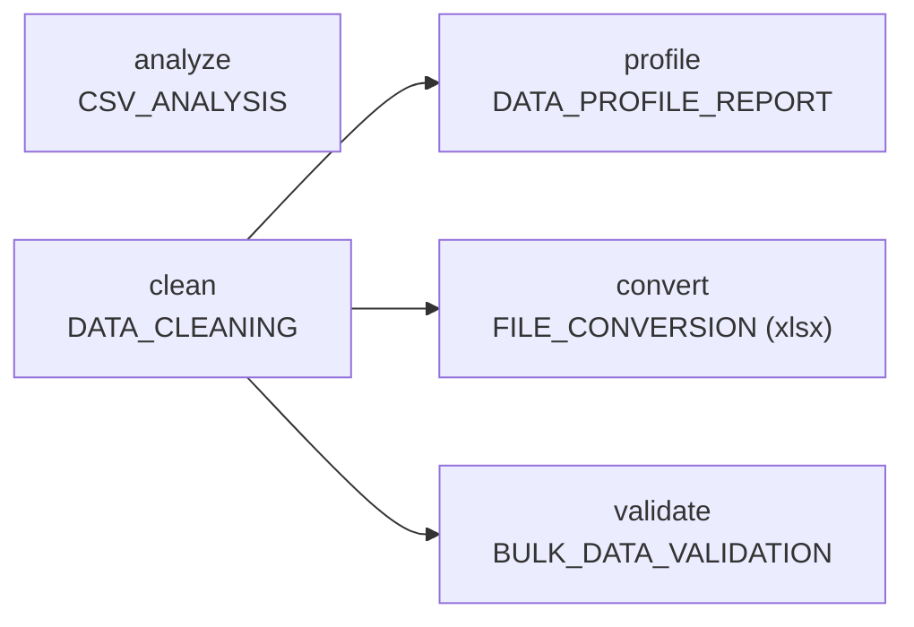

<div align="center">

# ⚙️ Distributed Data Processing & Workflow Orchestration Platform

**An asynchronous, queue-backed engine for running data-processing jobs and multi-step DAG workflows — with live monitoring, automatic retries, and metrics.**

Built with FastAPI · Celery · Redis · SQLAlchemy · React + TypeScript

[Why it exists](#-why-this-project-exists) ·
[Architecture](#-architecture) ·
[Features](#-key-features) ·
[System design](#-system-design) ·
[API](#-api-documentation) ·
[Quickstart](#-installation--quickstart)

</div>

---

## 🎯 Why This Project Exists

Real data work is **slow and bursty**. Parsing a CSV, profiling every column, or
validating thousands of rows can take seconds to minutes — far too long to do
inside an HTTP request without timing out the browser and blocking the server.

This platform solves that by separating **accepting work** from **doing work**:

- The API accepts an upload, records a job, and returns immediately (`202`-style "queued").
- A pool of background **workers** pulls jobs off a **Redis queue** and executes them.
- Clients **poll for status** and download results when the work is done.

On top of single jobs, it adds a **workflow engine**: chain jobs into a directed
acyclic graph (DAG), where independent steps run **in parallel** and dependent
steps wait for their inputs — the same idea behind tools like Airflow, but small
enough to read in an afternoon.

### Key engineering challenges solved

| Challenge | How it's handled |
|-----------|------------------|
| **Long-running work without blocking the API** | Celery workers + Redis broker; the API only enqueues |
| **Knowing when work finishes** | Status lifecycle persisted in the DB, polled by the UI |
| **Multi-step pipelines with ordering** | A DAG model + topological scheduler that dispatches ready tasks in parallel |
| **Invalid pipelines** | DAG validation (cycle / self-dependency / bad-reference detection) *before* anything runs |
| **Transient failures** | Per-task automatic retries with configurable delay; manual retry for standalone jobs |
| **Passing data between steps** | Each task's output file becomes the next task's input |
| **Clean separation of concerns** | Layered architecture: routers → services → scheduler → workers, no orchestration logic in HTTP handlers |
| **Database portability** | Dialect-agnostic models (SQLite today, PostgreSQL with one env var) |

---

## 📸 Screenshots

> _Placeholders — drop real screenshots/GIFs in `docs/screenshots/` and they'll render here._

### Dashboard — submit a job, see recent activity


### Job Monitoring — live status, results, downloads


### Workflow View — DAG graph with per-node status


### Metrics — success/failure rates & throughput


---

## 🏗️ Architecture



**Why these boundaries?**

- **API never executes workloads** — it validates, persists, and enqueues. This keeps request latency low and the web tier stateless/horizontally scalable.
- **Workers are a separate process** — they can be scaled, restarted, or crashed independently of the API; `task_acks_late` means a job isn't lost if a worker dies mid-run.
- **Redis is the seam** — the only thing the API and workers share at runtime, so each side scales on its own.
- **The scheduler engine is the single source of orchestration truth** — routers and workers call *into* it; it never reaches back into HTTP concerns.

---

## 📦 Project Overview

### What problem does it solve?

It turns expensive, file-based data operations into **fire-and-forget jobs** with
trackable status, downloadable outputs, and the ability to **compose them into
pipelines**. Upload a messy CSV → clean it → profile it → convert it → validate
it, all wired together and running with as much parallelism as the dependency
graph allows.

### Why asynchronous execution?

A synchronous request that profiles a large CSV would hold an HTTP connection
open for the entire computation — risking gateway timeouts, blocking a worker
thread, and giving the user a frozen page. Async execution returns control
instantly and does the heavy lifting elsewhere.

### Why a queue?

A queue (Redis) **decouples producers from consumers** and acts as a buffer:
spikes in submissions don't overwhelm the system, they just wait their turn.
It also enables **fan-out** — add more workers and they all pull from the same
queue, no code changes required.

### Why separate workers from the API?

Different scaling profiles and failure domains. The API is I/O-bound and should
stay responsive; workers are CPU/memory-bound (pandas). Isolating them means a
runaway job can't take down the web tier, and you can scale each to its own load.

---

## ✨ Key Features

### 🧩 Job Execution
- Five real data-processing workloads on uploaded CSVs:
  - **CSV_ANALYSIS** — row/column counts, dtypes, missing values, numeric stats
  - **DATA_CLEANING** — de-duplicate, trim whitespace, flag missing values → cleaned CSV
  - **FILE_CONVERSION** — CSV → JSON or XLSX
  - **DATA_PROFILE_REPORT** — per-column HTML profile report
  - **BULK_DATA_VALIDATION** — required-column + unique-id checks → JSON report
- Per-type **options validation** (strict Pydantic schemas; unknown keys rejected with `400`)
- Generated outputs are **downloadable** via a dedicated endpoint

### 🔗 Workflow Management
- Define pipelines as a **DAG** (`tasks` + `dependencies`) in JSON
- **DAG validation up front**: cycles, self-dependencies, duplicate ids, unknown references → `400`
- **Parallel execution** of independent branches; children wait for all parents
- **Inter-task data flow**: a child consumes the first parent's output file (else the workflow's original input)
- **Cancel** a running workflow (skips pending tasks, best-effort revoke of in-flight ones)

### 📊 Monitoring
- Job and workflow lists with **live 5-second polling**
- Per-job results, execution time, and error messages
- **Interactive DAG graph** with status colors (gray → blue → green / red)
- **Metrics endpoint**: totals by state, success/failure rate, average completion time

### ⏱️ Scheduling & Orchestration
- A **topological scheduler** advances the DAG as tasks complete
- Tasks dispatched to Celery with optional **`countdown` delay** (used for retry backoff)
- _(Time-based / cron scheduling is on the [roadmap](#-future-roadmap).)_

### 🛡️ Reliability
- Job/task lifecycle persisted at every transition (`PENDING → RUNNING → SUCCESS/FAILED`)
- **Automatic per-task retries** with configurable `max_retries` and `retry_delay`
- **Manual retry** endpoint for failed standalone jobs
- `task_acks_late=True` — a task survives a worker crash and is redelivered
- Global exception handlers turn DB / payload / DAG errors into clean JSON responses
- Path-traversal-safe file storage

### 📈 Scalability
- Stateless API tier → run N instances behind a load balancer
- Queue-based fan-out → run M workers, even on different machines
- Dialect-agnostic models → swap SQLite for PostgreSQL with one env var
- One-command **Docker Compose** stack for the whole system

---

## 🧠 System Design

### Request flow (single job)



### Job lifecycle



### Worker lifecycle

A worker process boots, connects to Redis, registers two tasks
(`app.tasks.process_job`, `app.workers.run_workflow_task`), and loops pulling
work. Each task **opens its own DB session** (`session_scope()`) — workers never
share the API's request-scoped session. Status is committed between transitions
so `RUNNING` is observable while the work happens. Because acknowledgement is
**late**, a crash before completion returns the task to the queue.

### Retry strategy

- **Standalone jobs:** failures are terminal but **manually retryable** (`POST /jobs/{id}/retry`), which resets the job to `PENDING` and re-enqueues it against the same input.
- **Workflow tasks:** failures are **automatically retried** while `retry_count < max_retries`, re-dispatched with a Celery `countdown` of `retry_delay` seconds (backoff). Only after the retry budget is exhausted is the task marked `FAILED` — which fails the workflow and marks remaining unfinished tasks `SKIPPED`.

### Dependency execution (the DAG scheduler)



The scheduler is **event-driven**: there's no polling loop. Each successful task
calls back into the engine, which promotes any child whose parents are all done.
This naturally yields **maximum safe parallelism** — every task that *can* run
*is* running.

---

## 🗄️ Database Design

### Entities & relationships



**Design notes**

- **UUID primary keys** — safe to expose, generated client-side in Python before flush, dialect-agnostic (`CHAR(32)` on SQLite, native `UUID` on PostgreSQL).
- **Enums stored by value** (`values_callable`) so the DB representation stays stable even if member names change.
- **JSON columns** (`payload`, `result`, `job_metadata`) give each job type a flexible shape without schema churn — the bulk *data* lives in files, not rows.
- **`task_dependencies`** is a classic edge table with a **composite primary key** `(parent_task_id, child_task_id)` — the DAG's adjacency list.
- **Indexes** on `status`, `job_type`, `created_at`, and FKs for the common list/filter queries.
- **`job_metadata`** is named to avoid SQLAlchemy's reserved `metadata` attribute.

Schema is managed with **Alembic** (5 migrations, `0001`–`0005`), written with
`batch_alter_table` so they apply cleanly on SQLite too.

---

## 🔌 API Documentation

Base URL: `http://localhost:8000` · Interactive docs (Swagger UI): `http://localhost:8000/docs`

### Jobs

| Method | Path | Description |
|--------|------|-------------|
| `POST` | `/jobs/upload` | Upload a CSV **and** create a job (multipart) |
| `POST` | `/jobs` | Create a job for an already-uploaded file (JSON) |
| `GET`  | `/jobs` | List jobs (newest first; `skip`, `limit`) |
| `GET`  | `/jobs/{id}` | Full job record |
| `GET`  | `/jobs/{id}/status` | Lightweight status payload |
| `GET`  | `/jobs/{id}/download` | Stream the generated output file |
| `POST` | `/jobs/{id}/retry` | Re-enqueue a `FAILED` job (`409` otherwise) |

**Create a job (multipart upload)**

```bash
curl -X POST http://localhost:8000/jobs/upload \
  -F "job_type=CSV_ANALYSIS" \
  -F "file=@data.csv" \
  -F 'options={}'
```

```jsonc
// 201 Created
{
  "id": "ff53f3d7-d920-4514-9985-437ab244a5fc",
  "task_name": "data.csv",
  "job_type": "CSV_ANALYSIS",
  "status": "PENDING",
  "result": null,
  "celery_task_id": "87525f2d-...",
  "created_at": "2026-06-14T10:12:53"
}
```

**Poll until done**

```bash
curl http://localhost:8000/jobs/ff53f3d7-.../status
# { "job_id": "...", "status": "SUCCESS", "execution_time": 0.0226, ... }
```

**Example `CSV_ANALYSIS` result**

```jsonc
{
  "row_count": 4,
  "column_count": 3,
  "columns": ["id", "name", "age"],
  "dtypes": { "id": "int64", "name": "str", "age": "int64" },
  "missing_values": { "id": 0, "name": 1, "age": 0 },
  "numeric_statistics": {
    "age": { "min": 25, "max": 40, "mean": 30.0, "median": 27.5 }
  }
}
```

### Workflows

| Method | Path | Description |
|--------|------|-------------|
| `POST` | `/workflows` | Create a workflow (validates the DAG; `400` if invalid) |
| `GET`  | `/workflows` | List workflows |
| `GET`  | `/workflows/metrics` | Aggregate metrics |
| `GET`  | `/workflows/{id}` | Workflow with tasks + dependency edges |
| `POST` | `/workflows/{id}/run` | Upload input file and start it (`409` if not `PENDING`) |
| `POST` | `/workflows/{id}/cancel` | Cancel a `PENDING`/`RUNNING` workflow |

**Create a workflow**

```bash
curl -X POST http://localhost:8000/workflows \
  -H "Content-Type: application/json" \
  -d '{
    "name": "Clean then profile",
    "tasks": [
      { "id": "clean",   "type": "DATA_CLEANING",       "max_retries": 2, "retry_delay": 5 },
      { "id": "profile", "type": "DATA_PROFILE_REPORT" }
    ],
    "dependencies": [ { "from": "clean", "to": "profile" } ]
  }'
```

**Run it**

```bash
curl -X POST http://localhost:8000/workflows/<id>/run -F "file=@data.csv"
```

**Metrics**

```jsonc
{
  "total": 12, "running": 1, "completed": 9, "failed": 1,
  "pending": 1, "cancelled": 0,
  "success_rate": 0.9, "failure_rate": 0.1,
  "avg_completion_seconds": 1.84
}
```

### Health

```bash
curl http://localhost:8000/health   # {"status":"healthy"}
```

---

## 🚀 Installation & Quickstart

### Option A — Docker (one command)

Requires Docker. Brings up Redis, the API, a worker, and the frontend:

```bash
docker compose up --build
```

- Dashboard → **http://localhost:5173**
- API docs → **http://localhost:8000/docs**

Migrations run automatically on startup. Stop with `Ctrl+C`; wipe all data with
`docker compose down -v`.

### Option B — Run it manually

**Prerequisites:** Python 3.12+, Node 18+, and a running Redis.

**1. Backend (once):**

```bash
cd backend
python -m venv .venv
# Windows:
.\.venv\Scripts\Activate.ps1
# macOS / Linux:
# source .venv/bin/activate
pip install -r requirements.txt
alembic upgrade head
```

Configuration is via environment variables (or a `backend/.env`). See
[`.env.example`](.env.example). Defaults work out of the box (SQLite + local Redis).

---

## ▶️ Running the System

Four processes, each in its own terminal:

| # | Component | Command |
|---|-----------|---------|
| 1 | **Redis** | `redis-server` _(Windows: WSL or Memurai)_ |
| 2 | **Celery worker** | `cd backend && celery -A app.celery_app worker --loglevel=info` |
| 3 | **API** | `cd backend && uvicorn app.main:app --reload` |
| 4 | **Frontend** | `cd frontend && npm install && npm run dev` |

> **Windows worker note:** add `--pool=solo`. On Linux/macOS use
> `--concurrency=4` for real parallel processing.

Then open **http://localhost:5173**.

---

## 🧪 Example Workflow (end to end)

A realistic pipeline: **analyze** raw data, **clean** it, then **profile**,
**convert**, and **validate** the cleaned output in parallel.



1. **Create** the workflow:

```bash
curl -X POST http://localhost:8000/workflows \
  -H "Content-Type: application/json" \
  -d '{
    "name": "Full Data Pipeline",
    "tasks": [
      { "id": "analyze",  "type": "CSV_ANALYSIS" },
      { "id": "clean",    "type": "DATA_CLEANING" },
      { "id": "profile",  "type": "DATA_PROFILE_REPORT" },
      { "id": "convert",  "type": "FILE_CONVERSION",      "payload": { "output_format": "xlsx" } },
      { "id": "validate", "type": "BULK_DATA_VALIDATION", "payload": { "required_columns": ["id"], "id_column": "id" } }
    ],
    "dependencies": [
      { "from": "clean", "to": "profile" },
      { "from": "clean", "to": "convert" },
      { "from": "clean", "to": "validate" }
    ]
  }'
```

2. **Run** it with an input file:

```bash
curl -X POST http://localhost:8000/workflows/<id>/run -F "file=@data.csv"
```

3. **Watch** it on the Workflows page. `analyze` and `clean` start immediately
   (no parents). When `clean` finishes, its cleaned CSV feeds `profile`,
   `convert`, and `validate`, which then run **simultaneously**. The graph turns
   green node by node; the workflow reports `COMPLETED`.

> The frontend's **New workflow** page ships a "Load example" button, a list of
> valid task types, and client-side validation so you can't submit a typo'd
> `type` or a dangling dependency.

---

## 📈 Scalability Discussion

- **Horizontal worker scaling** — workers are stateless consumers of one Redis queue. Run more processes (`--concurrency`) or more machines; throughput scales linearly until the broker or DB is the bottleneck. `docker compose up --scale worker=4` is enough to demonstrate fan-out.
- **Queue-based architecture** — Redis absorbs submission spikes and smooths load; the API never blocks on execution, so the web tier stays responsive and can itself be replicated behind a load balancer.
- **PostgreSQL migration** — models are deliberately dialect-agnostic. Uncomment `psycopg2-binary` in `requirements.txt`, set `DATABASE_URL=postgresql+psycopg2://…`, run `alembic upgrade head`. No code changes. Postgres also removes SQLite's single-writer limitation under concurrent workers.
- **Cloud deployment** — the Docker images map cleanly onto ECS/Fargate, Cloud Run, or Kubernetes: API as a web service, workers as a separate deployment (scaled on queue depth), managed Redis (ElastiCache/MemoryStore), managed Postgres (RDS/Cloud SQL), and object storage (S3/GCS) in place of the local `storage/` folder.

---

## ✅ Testing

```bash
cd backend
pytest -q
```

The suite (`backend/tests/`) covers:

- **`test_api.py`** — job upload, status, retry, download, error paths
- **`test_workflow_api.py`** — workflow create/run/cancel, DAG advancement
- **`test_dag.py`** — cycle / self-dependency / bad-reference detection
- **`test_payload_validation.py`** — per-type strict options validation
- **`test_services.py`** — each data-processing executor against real CSVs

Celery runs in **eager mode** during tests (`task_always_eager`) so workflow
tasks execute inline and the full pipeline is asserted deterministically — no
running broker required.

---

## 🗺️ Future Roadmap

- [ ] **PostgreSQL** as the default (concurrent-writer friendly)
- [x] **Docker / Docker Compose** for one-command local runs
- [ ] **Kubernetes** manifests + autoscaling workers on queue depth
- [ ] **WebSocket / SSE** push updates to replace 5-second polling
- [ ] **Time-based scheduling** (cron-style recurring workflows)
- [ ] **S3 / object storage** backend for uploads and outputs
- [ ] **Authentication & authorization** (API keys / OAuth)
- [ ] **Multi-tenancy** (per-tenant isolation, quotas, and metrics)
- [ ] Richer DAG features: conditional branches, fan-in aggregation, sub-workflows

---

## 🌟 Engineering Highlights

- **Event-driven DAG scheduler** that achieves maximum safe parallelism without a polling loop — each completed task promotes only the children whose dependencies are fully satisfied.
- **Robust DAG validation** (three-color DFS cycle detection) that rejects invalid pipelines *before* any compute is spent.
- **Two execution contexts, one executor** — standalone jobs and workflow nodes share a single `dispatch()` layer, so behavior is identical whether a task runs alone or inside a graph.
- **Correct concurrency model** — request-scoped sessions for the API, independent `session_scope()` sessions for workers, late acknowledgement for crash-safety, and status committed at each transition for observability.
- **Layered, testable architecture** — HTTP, business logic, orchestration, and execution are cleanly separated; the import graph is acyclic (lazy imports break the engine↔worker cycle deliberately).
- **Dialect-agnostic persistence** — UUIDs, enums, and JSON columns that behave correctly on both SQLite and PostgreSQL, with Alembic migrations that apply to both.
- **Production-minded API** — strict input validation, structured error responses via global exception handlers, path-traversal-safe file handling, and CORS configured for the SPA.

---

## 🤝 Contributing

Contributions are welcome!

1. **Fork** the repo and create a branch: `git checkout -b feat/your-feature`
2. **Set up** the backend and frontend (see [Installation](#-installation--quickstart)).
3. **Make your change.** Keep the layering intact — no orchestration logic in routers, no HTTP concerns in services/engine.
4. **Add tests** and make sure the suite passes: `pytest -q` (backend) and `npm run build` (frontend type-check).
5. **Open a PR** with a clear description of the what and why.

Good first issues: add a new `JobType` executor (service module + payload schema + dispatch entry + test), or implement an item from the roadmap.

---

## 📁 Project Structure

```
.
├── backend/
│   ├── app/
│   │   ├── routers/        # HTTP endpoints (thin): jobs, workflows, health
│   │   ├── services/       # data-processing executors + job business logic
│   │   ├── scheduler/      # DAG validation + workflow execution engine
│   │   ├── workers/        # Celery task: run one workflow node, advance DAG
│   │   ├── tasks/          # Celery task: run one standalone job; shared dispatch
│   │   ├── models/         # SQLAlchemy ORM: jobs, workflows, tasks, deps
│   │   ├── schemas/        # Pydantic request/response + payload validation
│   │   ├── core/           # config, logging, exceptions
│   │   ├── celery_app.py   # Celery instance (Redis broker + result backend)
│   │   ├── database.py     # engine, session factory, session scopes
│   │   ├── storage.py      # path-safe upload/output file handling
│   │   └── main.py         # FastAPI app factory + global error handlers
│   ├── alembic/            # migrations 0001–0005
│   └── tests/              # pytest suite (eager-mode Celery)
├── frontend/               # React + Vite + TypeScript + Tailwind SPA
│   └── src/
│       ├── pages/          # Dashboard, Jobs, Workflows, details, create
│       ├── components/     # WorkflowGraph (SVG DAG), badges, forms
│       ├── hooks/          # polling data hooks (5s)
│       └── services/api.ts # typed Axios client
├── docker-compose.yml      # Redis + API + worker + frontend
└── README.md
```

---

## 📄 License

Released under the **MIT License**. See [`LICENSE`](LICENSE) for details.

```
MIT License — Copyright (c) 2026
Permission is hereby granted, free of charge, to any person obtaining a copy...
```

---

<div align="center">

**Built to demonstrate distributed-systems thinking: async execution, queue-based scaling, and DAG orchestration — in a codebase small enough to read end to end.**

</div>
