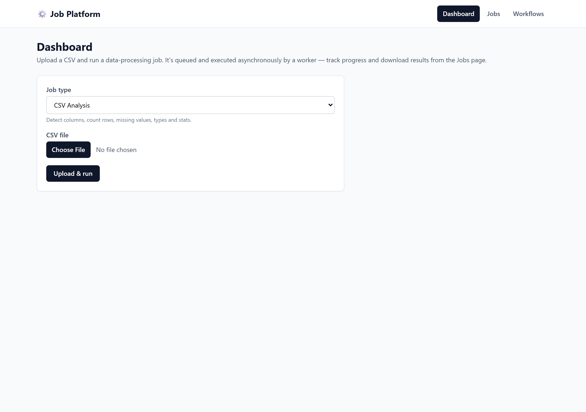
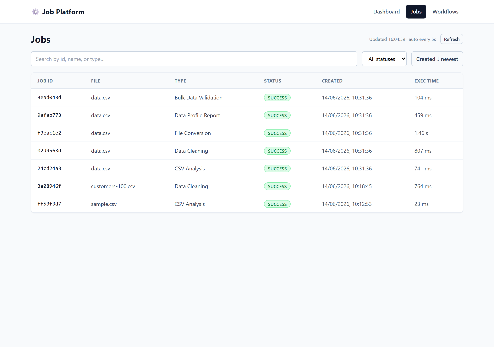
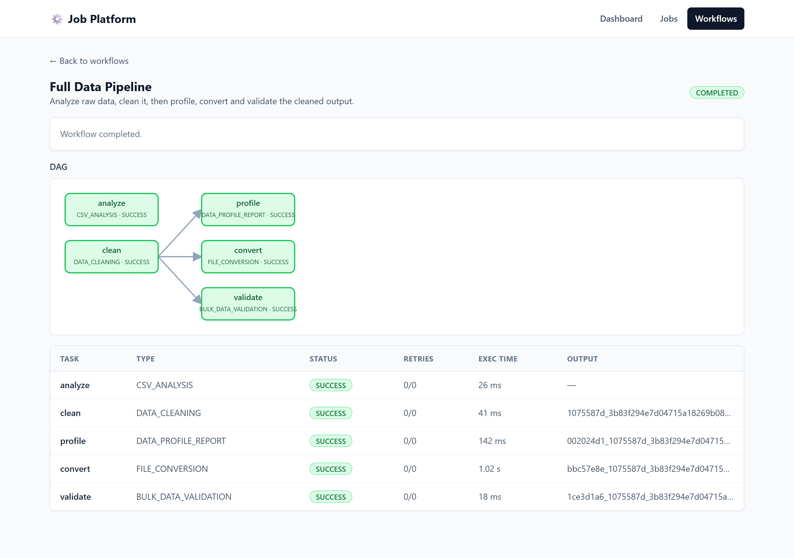
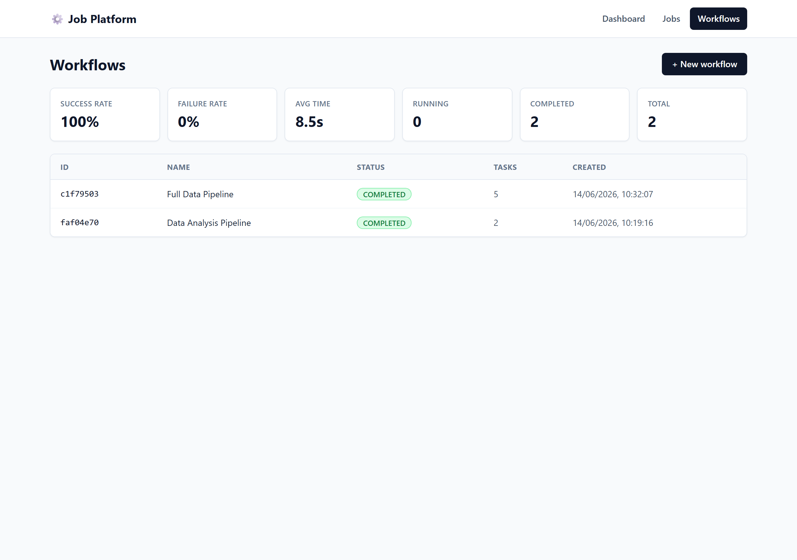
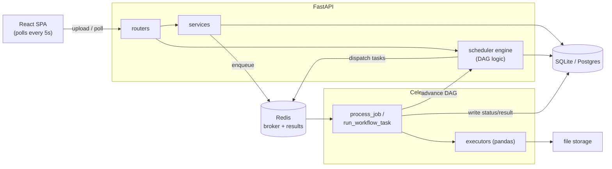
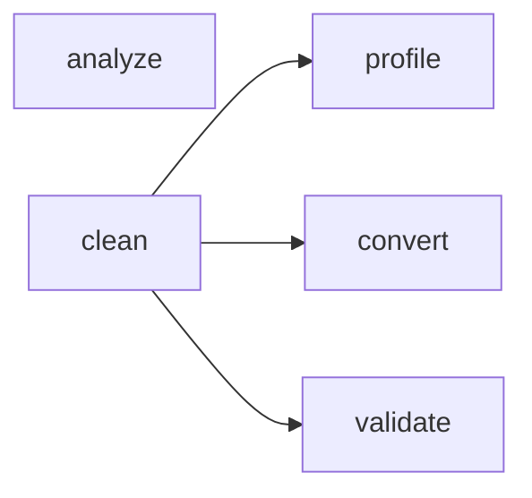

# Distributed Data Processing & Workflow Platform

A backend for running CSV data-processing jobs in the background, plus a workflow
engine for chaining those jobs into DAGs. Built with FastAPI, Celery, Redis, and
a small React dashboard.

I built this to get hands-on with async task queues and DAG scheduling instead of
just reading about them. It runs real workloads (pandas), not fake `sleep()` jobs.

## What it does

You upload a CSV and pick a job type. The API saves the file, creates a job, and
puts it on a Redis queue. A Celery worker picks it up, runs it, and stores the
result. The frontend polls for status every 5 seconds.

Job types:

- **CSV_ANALYSIS** – row/column counts, dtypes, missing values, numeric stats
- **DATA_CLEANING** – drop duplicates, trim whitespace, flag missing values → cleaned CSV
- **FILE_CONVERSION** – CSV → JSON or XLSX
- **DATA_PROFILE_REPORT** – per-column HTML report
- **BULK_DATA_VALIDATION** – check required columns and duplicate IDs → JSON report

On top of single jobs there's a **workflow engine**. You define a DAG (tasks +
dependencies) and it runs them in dependency order, with independent branches
running in parallel. A task's output file becomes the input for its children.

## Screenshots

| Dashboard | Jobs |
|---|---|
|  |  |

| Workflow (DAG) | Metrics |
|---|---|
|  |  |

## Architecture



The API never runs workloads itself — it validates, saves to the DB, and enqueues.
Workers run in their own process, so heavy pandas work can't block the API and you
can run more workers without touching the web tier. Redis is the only thing they
share at runtime. All the DAG logic lives in one place (`scheduler/engine.py`);
routers and workers call into it.

Workers use late acknowledgement (`task_acks_late`), so if a worker dies mid-job
the task goes back on the queue instead of being lost.

## Features

- 5 real data-processing job types (above)
- File upload + downloadable outputs
- Per-type options validated with Pydantic (unknown keys → 400)
- DAG workflows with parallel branches and inter-task file passing
- DAG validation up front: cycles, self-deps, duplicate ids, bad refs → 400
- Automatic per-task retries (`max_retries` + `retry_delay`); manual retry for single jobs
- Cancel a running workflow (skips pending tasks, revokes in-flight ones)
- Workflow metrics: counts by status, success/failure rate, avg completion time
- Live status via 5s polling + a DAG graph that colors nodes by status

## Tech stack

Python 3.12, FastAPI, SQLAlchemy 2.0, Alembic, Celery, Redis, pandas, Pydantic v2.
Frontend is React + Vite + TypeScript + Tailwind. SQLite by default (Postgres works
with one env var). Tests with pytest.

## Setup

### Docker (easiest)

```bash
docker compose up --build
```

Brings up Redis, the API, a worker, and the frontend. Migrations run on startup.

- Frontend: http://localhost:5173
- API docs: http://localhost:8000/docs

Stop with `Ctrl+C`, wipe data with `docker compose down -v`.

### Manual

Needs Python 3.12+, Node 18+, and Redis running.

```bash
cd backend
python -m venv .venv
.\.venv\Scripts\Activate.ps1     # Windows
# source .venv/bin/activate       # macOS / Linux
pip install -r requirements.txt
alembic upgrade head
```

Defaults work out of the box (SQLite + Redis on localhost). To override anything,
copy `.env.example` to `backend/.env`. To use Postgres, uncomment `psycopg2-binary`
in `requirements.txt` and set `DATABASE_URL` — no code changes needed.

## Running

Four processes, one per terminal:

| # | What | Command |
|---|------|---------|
| 1 | Redis | `redis-server` (Windows: WSL or Memurai) |
| 2 | Worker | `cd backend && celery -A app.celery_app worker --loglevel=info` |
| 3 | API | `cd backend && uvicorn app.main:app --reload` |
| 4 | Frontend | `cd frontend && npm install && npm run dev` |

On Windows add `--pool=solo` to the worker. On Linux/macOS use `--concurrency=4`
for actual parallelism.

## API

Full docs at `/docs`. The main endpoints:

**Jobs**

| Method | Path | Notes |
|--------|------|-------|
| POST | `/jobs/upload` | upload CSV + create job (multipart) |
| POST | `/jobs` | create a job for an already-uploaded file |
| GET | `/jobs` | list |
| GET | `/jobs/{id}` | full record |
| GET | `/jobs/{id}/status` | status only |
| GET | `/jobs/{id}/download` | download output file |
| POST | `/jobs/{id}/retry` | retry a FAILED job (409 otherwise) |

**Workflows**

| Method | Path | Notes |
|--------|------|-------|
| POST | `/workflows` | create (validates the DAG, 400 if invalid) |
| GET | `/workflows` | list |
| GET | `/workflows/metrics` | aggregate metrics |
| GET | `/workflows/{id}` | tasks + dependency edges |
| POST | `/workflows/{id}/run` | upload input file and start (409 if not PENDING) |
| POST | `/workflows/{id}/cancel` | cancel |

Submit a job and check it:

```bash
curl -X POST http://localhost:8000/jobs/upload \
  -F "job_type=CSV_ANALYSIS" -F "file=@data.csv" -F 'options={}'

curl http://localhost:8000/jobs/<id>/status
# {"job_id":"...","status":"SUCCESS","execution_time":0.0226,...}
```

CSV_ANALYSIS result:

```jsonc
{
  "row_count": 4,
  "column_count": 3,
  "dtypes": { "id": "int64", "name": "str", "age": "int64" },
  "missing_values": { "id": 0, "name": 1, "age": 0 },
  "numeric_statistics": { "age": { "min": 25, "max": 40, "mean": 30.0, "median": 27.5 } }
}
```

## Example: a workflow

Analyze the raw file and clean it, then profile/convert/validate the cleaned
output in parallel:



```bash
# 1. create
curl -X POST http://localhost:8000/workflows \
  -H "Content-Type: application/json" \
  -d '{
    "name": "Full Data Pipeline",
    "tasks": [
      { "id": "analyze",  "type": "CSV_ANALYSIS" },
      { "id": "clean",    "type": "DATA_CLEANING" },
      { "id": "profile",  "type": "DATA_PROFILE_REPORT" },
      { "id": "convert",  "type": "FILE_CONVERSION",      "payload": { "output_format": "xlsx" } },
      { "id": "validate", "type": "BULK_DATA_VALIDATION", "payload": { "required_columns": ["id"], "id_column": "id" } }
    ],
    "dependencies": [
      { "from": "clean", "to": "profile" },
      { "from": "clean", "to": "convert" },
      { "from": "clean", "to": "validate" }
    ]
  }'

# 2. run it with an input file
curl -X POST http://localhost:8000/workflows/<id>/run -F "file=@data.csv"
```

`analyze` and `clean` start right away (no parents). When `clean` finishes, its
cleaned CSV feeds the other three, which run at the same time.

The frontend's "New workflow" page has a "Load example" button and validates the
JSON before submitting, so you can't send a typo'd task type or a dangling
dependency.

## Database

Four tables: `jobs`, `workflows`, `workflow_tasks`, `task_dependencies`.

- UUID primary keys, generated in Python.
- Enums and JSON columns work on both SQLite and Postgres, so switching DBs needs
  no code changes. Job options/results are JSON; the actual data stays in files.
- `task_dependencies` is an edge table with a composite PK `(parent_task_id,
  child_task_id)` — that's the DAG.
- Schema managed with Alembic (migrations 0001–0005, written to apply on SQLite too).

## How execution works

Single job: `PENDING → RUNNING → SUCCESS/FAILED`. A failed job stays failed but you
can retry it, which resets it to PENDING and re-queues it against the same file.

Workflow task: `PENDING → READY → RUNNING → SUCCESS/FAILED` (or `SKIPPED` if the
workflow failed/was cancelled before it ran). On failure it retries up to
`max_retries` (re-dispatched with a `countdown` delay). If it still fails, the task
is marked FAILED, the workflow fails, and remaining tasks are skipped.

The scheduler doesn't poll. Each successful task calls back into the engine, which
checks every child and dispatches the ones whose parents are all done.

Workers use their own DB session (`session_scope()`), separate from the API's
request session, and commit between status changes so RUNNING is visible while work
happens.

## Tests

```bash
cd backend
pytest -q
```

Covers the job API, workflow create/run/cancel, DAG validation, payload validation,
and each executor against real CSVs. Celery runs in eager mode during tests so
workflows execute inline — no broker needed.

## Project structure

```
backend/app/
├── routers/      HTTP endpoints (thin): jobs, workflows, health
├── services/     data-processing executors + job business logic
├── scheduler/    DAG validation (dag.py) + workflow engine (engine.py)
├── workers/      Celery task for one workflow node; advances the DAG
├── tasks/        Celery task for a single job; shared dispatch
├── models/       SQLAlchemy models
├── schemas/      Pydantic request/response + payload validation
├── core/         config, logging, exceptions
├── celery_app.py Celery setup (Redis broker + backend)
├── database.py   engine, sessions
├── storage.py    upload/output file handling
└── main.py       app factory + error handlers

frontend/src/     React dashboard (pages, components, hooks, api client)
```


## Future Roadmap

1. Authentication
2. Postgres as default
3. WebSocket/SSE updates instead of polling


## Contributing

PRs welcome. Keep the layers separate (no DAG logic in routers, no HTTP in
services/engine), add tests, and run `pytest -q` + `npm run build` before opening.
Adding a new job type is a good starting point: service module + payload schema +
a `dispatch()` entry + a test.

## License

MIT — see [LICENSE](LICENSE).
